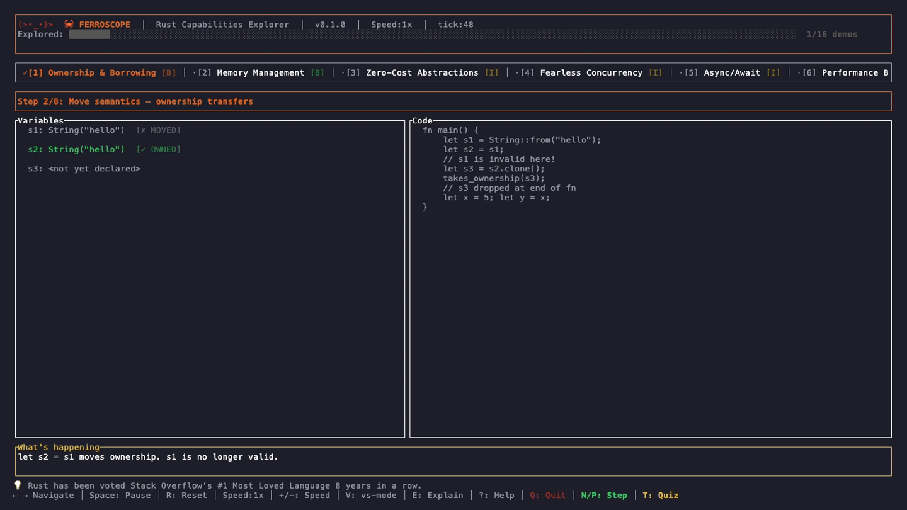

# 🦀🔭 Ferroscope

> **See Rust's power in real time.** 16 live interactive demos covering ownership,
> zero-cost abstractions, fearless concurrency, async I/O, lifetimes, WASM, macros,
> and more — all in a blazing-fast terminal UI. Written in 100% Rust.

[](https://github.com/wesleyscholl/ferroscope/actions/workflows/ci.yml)
[](LICENSE)
[](https://www.rust-lang.org)



---

## Demos

| Key | Demo | Level | Step Control | Quiz |
|-----|------|-------|:---:|:---:|
| `1` | Ownership & Borrowing | Beginner | ✓ | ✓ |
| `2` | Memory Management | Beginner | | ✓ |
| `3` | Zero-Cost Abstractions | Intermediate | | ✓ |
| `4` | Fearless Concurrency | Beginner | | ✓ |
| `5` | Async/Await | Intermediate | | ✓ |
| `6` | Performance Benchmarks | Intermediate | | ✓ |
| `7` | Type System | Intermediate | ✓ | ✓ |
| `8` | Error Handling | Intermediate | ✓ | ✓ |
| `9` | Lifetimes | Advanced | ✓ | ✓ |
| `0` | Unsafe Rust | Advanced | | ✓ |
| `a` | WebAssembly | Intermediate | | ✓ |
| `b` | System Metrics | Intermediate | | ✓ |
| `c` | Compile-Time Guarantees | Intermediate | | ✓ |
| `d` | Cargo Ecosystem | Advanced | | ✓ |
| `f` | Embedded / no\_std | Intermediate | | ✓ |
| `g` | Macros | Intermediate | ✓ | ✓ |

---

## Interactive Features

### Step Control  (`N` / `P`)
Demos marked ✓ support manual step control. Press **`N`** to advance to the next
conceptual step and **`P`** to go back — turn any animated demo into a self-paced
tutorial.

### Quiz Mode (`T`)
Every demo has a built-in quiz question. Press **`T`** to open the quiz overlay,
then **`1`–`4`** to submit your answer. Your score is tracked across the session.

### Rainbow Konami Mode 🦀
Enter the classic Konami code (`↑ ↑ ↓ ↓ ← → ← → B A`) for a surprise. The entire UI
switches to animated rainbow colors per-character. Press any navigation key to exit.

### Particle Bursts ✨
Unlock achievements (visit demos, hit speed records) and watch particle effects burst
across the screen.

### Transition Wipe
Switching between demos triggers a smooth horizontal reveal animation.

### VS Mode (`V`)
Toggle a side-by-side Rust vs C++ comparison panel on supported demos.

### Explanation Panel (`E`)
Every demo ships with a prose explanation panel written by a Rustacean. Expand it
with `E` and scroll with `j`/`k`.

---

## Quick Start

```bash
# Clone
git clone https://github.com/wesleyscholl/ferroscope.git
cd ferroscope

# Build & run (release mode for best performance)
cargo run --release

# Or install globally
cargo install --path .
ferroscope
```

---

## Options

| Flag | Description | Default |
|------|-------------|---------|
| `--fps N` | Tick rate, 5–120 fps | `30` |
| `--tour` | Auto-advance through all 16 demos | off |
| `--screenshot` | Headless text export of every demo | off |
| `--screenshot-dir <path>` | Output directory for screenshot exports | `ferroscope-screenshots` |
| `--version` | Print version and exit | — |

---

## Key Bindings

| Key | Action |
|-----|--------|
| `← / h`, `→ / l` | Previous / Next demo |
| `1`–`9`, `0` | Jump to demo 1–10 |
| `a`, `b`, `c`, `d`, `f`, `g` | Jump to demo 11–16 |
| `Space` | Pause / Resume animation |
| `R` | Reset current demo |
| `N` / `P` | Step forward / back (step-control demos) |
| `T` | Open quiz overlay |
| `1`–`4` | Answer quiz question (when quiz open) |
| `+` / `-` | Increase / decrease speed |
| `V` | Toggle vs-mode (Rust vs C++) |
| `E` | Toggle explanation panel |
| `j` / `↓` | Scroll explanation down |
| `k` / `↑` | Scroll explanation up |
| `S` | Screenshot (save text export) |
| `?` | Toggle help overlay |
| `Q` / `Esc` | Quit |
| Konami code | Activate rainbow CRAB MODE 🦀 |

---

## Requirements

- Rust 1.87+
- A 256-color terminal (iTerm2, Terminal.app, Alacritty, WezTerm, kitty, etc.)
- Minimum **120 × 34** terminal size recommended

---

## Architecture

```
ferroscope/
├── src/
│   ├── main.rs          # CLI args, terminal setup, run_app() event loop
│   ├── app.rs           # App state: demos, particles, quiz, transitions, Konami
│   ├── events.rs        # AppEvent enum + key_event_to_app_event()
│   ├── theme.rs         # Rust-orange color palette, HSV rainbow helpers
│   ├── ui/
│   │   ├── header.rs    # Animated crab, rainbow Konami title, progress bar
│   │   ├── footer.rs    # Key hints, N/P + T dynamic hints, rolling Rust facts
│   │   ├── nav.rs       # Tab bar with difficulty badges and mouse support
│   │   ├── layout.rs    # Responsive layout calculation
│   │   ├── quiz.rs      # Quiz overlay widget with score tracking
│   │   └── widgets/     # GaugeBar (pulse), FlameGraph (gradient), SparklineExt, ...
│   └── demos/
│       ├── mod.rs       # Demo trait + DemoRegistry
│       ├── d01_ownership/   d02_memory/   d03_zero_cost/
│       ├── d04_concurrency/ d05_async/    d06_performance/
│       ├── d07_type_system/ d08_error_handling/ d09_lifetimes/
│       ├── d10_unsafe/  d11_wasm/  d12_system_metrics/
│       ├── d13_compile_time/ d14_cargo_ecosystem/ d15_no_std/
│       └── d16_macros/      # macro_rules!, hygiene, proc-macros, C vs Rust
└── benches/             # criterion benchmarks: sort, alloc, iter
```

---

## Re-generating the Demo GIF

The demo GIF is produced with [VHS](https://github.com/charmbracelet/vhs):

```bash
brew install vhs          # macOS — also installs ffmpeg + ttyd
cargo build --release
vhs demo.tape             # outputs assets/demo.gif
```

---

## License

MIT — see [LICENSE](LICENSE).
